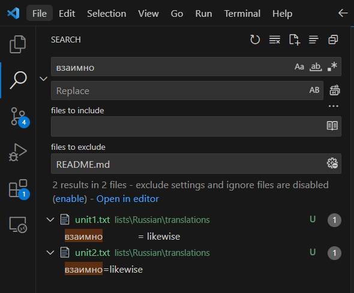

#  StudyGo Wordlists
> Collection of word lists to learn languages.

## Usage
> Lists can be **directly imported** into _StudyGo_.

All lists are available under [`./lists` directory](https://github.com/dainank/word-lists-studygo/tree/b1114465342589912aac51b08eb666a1db854e64/lists).

> You can verify duplicate entries by searching the repository for more than one reference of a word:

At some point, this will be automatically checked on push.

## Supported Languages
> You can **contribute your own lists through issues/pull-requests** if desired.

- [Russian](https://github.com/dainank/word-lists-studygo/tree/b1114465342589912aac51b08eb666a1db854e64/lists/Russian)
- [French](https://github.com/dainank/word-lists-studygo/tree/b1114465342589912aac51b08eb666a1db854e64/lists/French)
- [Luxembourgish](https://github.com/dainank/word-lists-studygo/tree/main/lists/Luxembourgish)